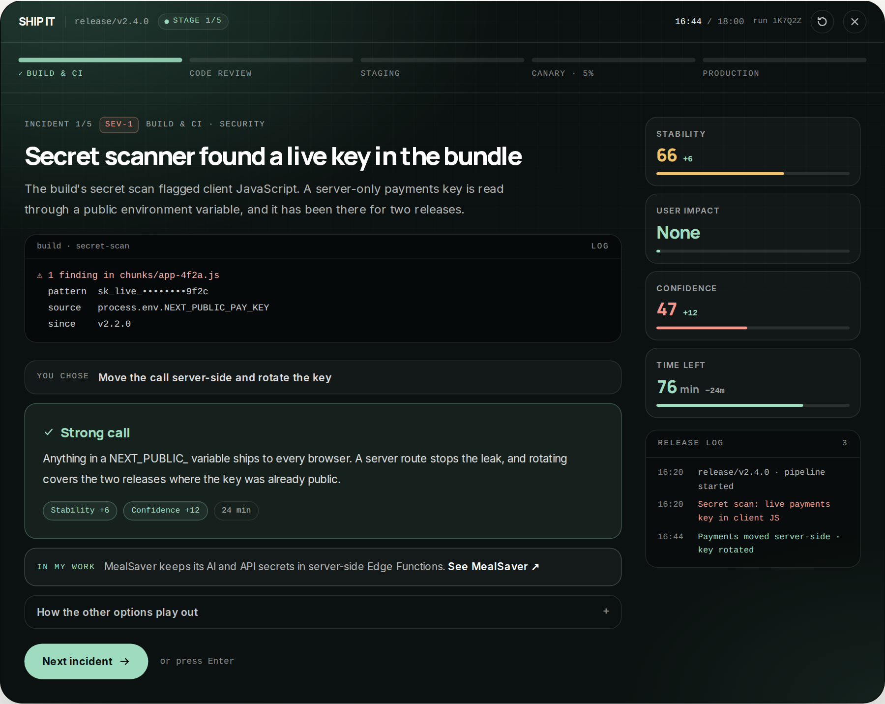
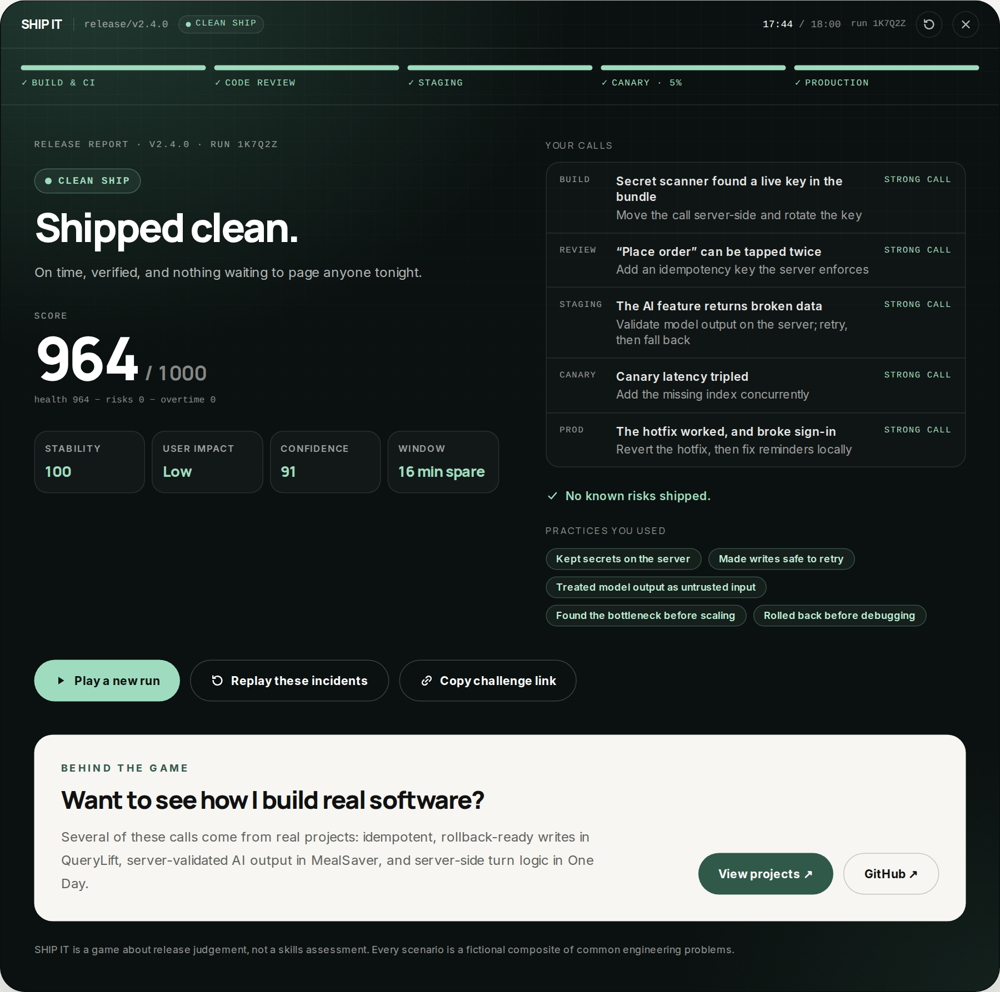

# SHIP IT

**A 90-second game about the judgement calls behind a production release.**

You're the engineer on point for release v2.4.0. Five incidents stand between you and production: a flaky test, an AI-generated diff, a 401 that only happens in staging, a failing canary. Every action costs time from a 100-minute release window, and some shortcuts come back two stages later as incidents of their own.

**Play it:** [madebycaissie.com/risto#ship-it](https://madebycaissie.com/risto#ship-it). To play the exact run below, use [`?run=1K7Q2Z`](https://madebycaissie.com/risto?run=1K7Q2Z#ship-it).





Built by [Risto Caissie](https://madebycaissie.com/risto). This is a standalone copy of the game that runs on the portfolio; only its outbound links differ (`src/features/ship-it/site.ts`).

## What it's about

It tests judgement, not trivia. The best call isn't always the most thorough one: rewriting a feature by hand costs half the release window, and debugging a failing canary live costs real users. The calls that score well are the proportionate ones:

- reproducing a flaky failure with its seed instead of re-running CI
- reviewing AI-generated code before it ships, and using AI to narrow the search while the logs make the final call
- making writes idempotent so retries are safe
- letting the database enforce invariants instead of racing check-then-insert
- rolling back first and debugging after
- treating model output as untrusted input

After each call, a short explanation says why it played out the way it did, and "How the other options play out" shows the alternatives. The report lists your calls, any risks you shipped, and the practices you used.

Every scenario is a fictional composite of common engineering problems. The score is about release judgement, not a skills assessment.

## How it's built

```
src/features/ship-it/
  engine/     Pure TypeScript game logic. No React, no DOM, no content.
  content/    The incident library as typed data: incidents, risks, practices, rules
  ui/         React components, loaded only when someone presses Start
  ShipItLauncher.tsx   Preview, lazy loading and the error boundary
  ShipItSection.tsx    Server-rendered section wrapper
tests/        node:test suites run directly on the TypeScript sources
```

- **Deterministic engine.** Everything goes through one pure reducer (`choose`, `advance`, `restart`). A run is fully determined by its seed, which picks the incidents and the order their choices appear, so runs can be replayed, shared as a code, and tested exhaustively.
- **Constraints without bias.** A run never repeats a concept and always includes an AI incident. Rejection sampling keeps every valid run equally likely, with a depth-first search as a guaranteed fallback.
- **Consequences.** A shortcut can leave a risk. If the risk points at a follow-up and is still open, that incident replaces the one planned two stages later. A critical risk that ships means a production incident, however healthy the meters look.
- **Content as data.** A validator checks the library for broken references, incidents without a strong answer, orphaned follow-ups, and constraints no run can meet. Typed ids turn a misspelled risk into a compile error.
- **Loaded on demand.** The launcher adds about 5 KB of gzipped JavaScript to the page. The engine, content and UI are a separate 25 KB chunk fetched on Start (and prefetched on hover). An error boundary contains failures, and "Try again" really re-fetches a chunk that failed to load.
- **Accessible.** Keys 1–4 and Enter work while focus is inside the game. Focus moves to each new heading, a status region announces metric changes, and reduced motion is respected. It works at 320px, with no axe violations in any state.
- **No extra dependencies.** Only Next.js, React and Tailwind; no game engine, animation or icon libraries.

See [`src/features/ship-it/README.md`](src/features/ship-it/README.md) for the engine in more detail and for how to add an incident.

## Tests

61 tests using `node:test`, run directly on the TypeScript sources through Node's type stripping, with no test framework:

- **Engine:** transitions, clamping, ignored actions, follow-up scheduling and cancellation, restart, derived views
- **Outcome and scoring:** the threshold between each release outcome, and the score breakdown
- **Content:** library validation, copy-length budgets for small screens, related-work links, and plan constraints across 5,000 seeds
- **Balance:** invariants across 1,000 seeded runs. Strong calls always ship clean and on time, always taking the fastest option ends in rollback or worse, and always taking the slowest never ships clean.

## Running it

Requires Node 22.18 or newer.

```bash
npm install
npm run dev          # http://localhost:3000
npm test
npm run typecheck    # app, plus tests with erasable-syntax-only settings
npm run lint
npm run build
```

On Windows PowerShell, use `npm.cmd` in place of `npm`.
